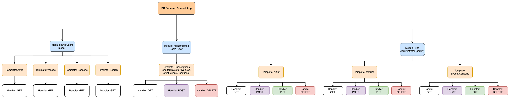

# ORDS Concert App - Defining and Creating the RESTful services

## The Concert App API 

Now that we have an Schema and some Database Objects defined we can start asking ourselves some questions 🧐: 

- What kind of REST Services does the App needs?
- How those services should be structured? 
- Who should use those services? 
- How do those services look?
- How do we know that a user is entitled to use those services? 

Before we answer these questions, we need to consider how ORDS structures and implements RESTful services.

## Understanding how ORDS implements RESTful services

ORDS has 4 structures that are used to implement a RESTful service: 

### Schema

At the highest level we have the schema, by REST Enabling a Schema we tell ORDS that this Database Schema contains RESTful resources (Modules, Templates and Handlers) and we also specify the URL pattern that will be used to direct REST requests to the appropriate resources. For example: 

```sql
ORDS.ENABLE_SCHEMA(
    P_ENABLED             => TRUE,
    P_SCHEMA              => 'CONCERT_SAMPLE_APP',
    P_URL_MAPPING_PATTERN => 'ordsconcertapp',
);
```
- REST Enables the `CONCERT_SAMPLE_APP`.
- Tells ORDS that it should route all of the request that contains the `/ordsconcertapp/*` pattern in their URL to the appropriate handler of that schema. 

For more info about REST Enabling a Schema see [The ORDS.ENABLE_SCHEMA Package Reference](https://docs.oracle.com/en/database/oracle/oracle-rest-data-services/24.2/orddg/ORDS-reference.html#GUID-8A4C061C-8ED0-41F2-9F1B-9EC701C8F186)

### Module

A module is a collection of RESTful services and it's main advantage is that it allow us to aggregate related services into a single URL component. Another advantage of modules is that it allow us to implement version control for our API endpoints. For example: 

```sql
ORDS.DEFINE_MODULE(
    P_MODULE_NAME => 'concert_app.euser.v1', 
    P_BASE_PATH => 'euser/v1/', 
    P_ITEMS_PER_PAGE => 0, 
    P_STATUS => 'PUBLISHED',
    P_COMMENTS => 'end user APIs Version 1'
);
```
- Creates the `concert_app.euser.v1` module.
- Associates such module to the `euser/v1/*` URI base pattern.
- Makes RESTful services under such module available for use. 

For more info about REST Enabling a Schema see [The ORDS.DEFINE_MODULE Package Reference](https://docs.oracle.com/en/database/oracle/oracle-rest-data-services/24.2/orddg/ORDS-reference.html#GUID-7FC25CDA-E359-4406-9555-04C68FB55EE4)

### Template

A template is the REST representation of a resource and also represent the final part of the REST service URL. A template must be unique within the module and is associated with a specific path which may or may not include parameters. For example:

```sql
ORDS.DEFINE_TEMPLATE(
    P_MODULE_NAME => 'concert_app.euser.v1', 
    P_PATTERN => 'artist/:id', 
    P_COMMENTS => 'Artist resource for end users'
);
```
- Creates the `artist/:id` template. This pattern will be used to determine if a request should be handled by a handler of this template and it also allows to specify a parameter that can be used by the template handlers. 
- Associates the created template to the `concert_app.euser.v1` module.

For more info about ORDS Templates see [The ORDS.DEFINE_TEMPLATE Package Reference](https://docs.oracle.com/en/database/oracle/oracle-rest-data-services/24.2/orddg/ORDS-reference.html#GUID-CD430033-DD38-4997-B125-C400776CFFB2)

### Handler

A handler is the link between a template/source and the HTTP method used to invoke such service. This is where the actual logic of the handler lives. For example: 

```sql
ORDS.DEFINE_HANDLER(
    P_MODULE_NAME => 'concert_app.euser.v1', 
    P_PATTERN => 'artist/:id', 
    P_METHOD => 'GET', 
    P_SOURCE_TYPE => ords.source_type_collection_feed, 
    P_SOURCE => 'SELECT * FROM ARTISTS WHERE ARTIST_ID = :id',
    P_ITEMS_PER_PAGE => 10
);
```

- Associates the handler to the `concert_app.euser.v1` module. 
- Associates the handler to the `artist/:id` template by using the same pattern.
- Associates the handler to the `GET` http action. 
- Set the source type to the appropriate one, See [ORDS Source Types](https://www.thatjeffsmith.com/archive/2019/02/ords-and-source-types/) to learn more.
- Specifies the source of the handler, in this case we have a simple `SELECT` statement that uses the :id URI parameter. 

For more info about ORDS Handlers see [The ORDS.DEFINE_HANDLER Package Reference](https://docs.oracle.com/en/database/oracle/oracle-rest-data-services/24.2/orddg/ORDS-reference.html#GUID-3393526F-0E85-49D8-AB2B-71048C9E0031)

## The ORDS Concert API 

Now that we understand how ORDS structures a RESTful services we can start thinking about how we are going to structure the ORDS Concert App API. 

Here is a Diagram of how we will be structuring the API. 



### First Step: Modeling our Endpoints 

Before we start modeling our endpoints we first need to understand who is going to use our API endpoints so we can take advantage of the ORDS Module feature to aggregate our API endpoints. For the sample app we have three possible users: 

- **End User**: An End User should have limited access to our API endpoints and by limited access we mean READ ONLY access. 
- **Authenticated User**: An Authenticated User should have access to all of the End User Endpoints plus endpoints that allow the user to interact with the ORDS Concert App (like subscribing to an artist a venue a concert, etc). So an Authenticated User should be able to modify resources in the Database. 
- **Admin User**: An Admin User should have full access to API endpoints that allows an Application Administrator to fully mange the Application (like performing CRUD operations over Artists, Venues, Events and more).

Modeling our endpoints should be an easy task since we will be exposing database objects as REST API objects so, for example, one of our object models can be as simple and straightforward as a SQL query: 

```sql
SELECT * FROM ARTISTS;
```
Or require of some sort of validation: 

```sql
BEGIN
      DELETE FROM ARTISTS
      WHERE ARTIST_ID = :id;

      IF SQL%ROWCOUNT = 0 THEN
          :status_code:= 404;
          :pv_result := ''Invalid artist id'';
          :pn_status := ''NO_MATCH'';
      ELSE
          :status_code:= 200;
          :pv_result := ''Artist Deleted'';
          :pn_status := ''SUCCESS'';
      END IF;

      EXCEPTION 
          WHEN OTHERS THEN 
          :status_code:= 400;
          :pv_result := ''UNABLE TO DELETE ARTIST'' || SQLERRM;
          :pn_status := ''ERROR'';
    END;
```

You can see each one of the objects that we use to model our API endpoints by looking into the [End User Models](endUserModule.js), the [Authenticated User Models](authenticatedUserModule.js) and [Admin User Models](adminUserModule.js).

Finally, keep in mind that most of the Object Definitions as well as te Database Objects that the project requires came from a list of requirements, here is the list of requirements/user stories that we defined during the design phase of the ORDS Concert App for the actions that a User should be able to perform. 

- User Stories:
    - Users can subscribe to their favorite artists and receive real-time alerts when new concert dates are announced, ensuring they never miss a performance.
    - Users can subscribe to specific cities venues and receive notifications for all upcoming concerts and events in that location, ensuring they stay informed about the local music scene.
    - Allow users to see the popularity of upcoming events.
    - Maintain a personalized concert calendar for each user, displaying all upcoming events for their subscribed artists, making it easy to plan their schedule.
    - Enable users to track an artist's entire tour schedule, making it easy to plan attendance for multiple concerts across different cities.

### Second Step: How do the URI's look

Now that we know who is going to use our Endpoints we can define our ORDS Modules and for that we will be using the user actions as a base to define the ORDS Concert App Modules.

| MODULE NAME | PATTERN | COMMENTS |
|------------ | ------- | -------- |
|'concert_app.euser.v1' | /euser/v1/ | Provides access to the first version of the End User RESTful API Endpoints | 
|'concert_app.authuser.v1' | /authuser/v1/ | Provides access to the first version of the Authenticated User RESTful API Endpoints | 
|'concert_app.admin.v1' | /adminuser/v1/ | Provides access to the first version of the Administrator RESTful API Endpoints | 

From here defining the ORDS Templates is pretty straightforward, we just need to think on the actions that each user needs to perform as well as the query parameters that each one of the API endpoints support.  

| User Type | API Endpoint | HTTP Method |  Description | Payload |
|---------- | ------------ | ----------- | ----------- | -------- |
| End User | `ordsconcertapp/euser/v1/artists` | GET | See all of the available Artists | N/A |
| End User | `ordsconcertapp/euser/v1/artist/:artist_id` | GET | Gets an specific Artist Information. |  N/A |
| Authenticated User | `ordsconcertapp/authuser/v1/liked_event/` | POST | Subscribes a User the specified event. | `{"artist_id" : 100, "user_id" : "user_id"}`| 
|Admin User | `ordsconcertapp/euser/v1/artists` | DELETE | Drops a User from the platform. | `{"artist_id" : 100 }`| 

You can see the whole [Open API Documentation of the ORDS Concert App](<link_here>).

### Third Step: Object Representation

Lucky for us, our API objects are tied to Database Objects which means that ORDS will take care of executing the SQL or PL/SQL Source of our Handler whose result will be transformed into a JSON object. 

Now we need to define how the responses of our API Endpoints will look like, and for that we need to properly specify the appropriate [Source Type](https://docs.oracle.com/en/database/oracle/oracle-rest-data-services/24.2/orddg/ORDS-reference.html#GUID-3393526F-0E85-49D8-AB2B-71048C9E0031).

For example, the response of a GET request made to the `/ords/ordsconcertapp/euser/v1/artists` Endpoint whose handler has a Source Type of `ords.source_type_collection_feed` will look like this: 

```json
{
    "items": [
        {
            "artist_id": 200,
            "name": "Celeste Radiant",
            "description": "At their next concert, Celeste Radiant will enchant the crowd, delivering a performance that will be both breathtaking and emotionally charged, creating a night to remember.",
            "bio": "Renowned for their electrifying guitar solos, Celeste Radiant has shaped modern rock with powerful riffs and a commanding stage presence that captivates audiences."
        },
        {
            "artist_id": 209,
            "name": "Elara Whimsical",
            "description": "Elara Whimsical's upcoming concert promises to be a mesmerizing experience, set to captivate the audience with an emotional and unforgettable performance that will leave everyone in awe.",
            "bio": "With a talent for storytelling, Elara Whimsical's hip-hop beats explore personal and social themes, redefining the genre and leaving a lasting impact on listeners."
        }
    ],
    "hasMore": true,
    "limit": 10,
    "offset": 0,
    "count": 10,
    "links": [
        {
            "rel": "self",
            "href": "/ords/ordsconcertapp/euser/v1/artists/"
        },
        {
            "rel": "describedby",
            "href": "/ords/ordsconcertapp/metadata-catalog/euser/v1/artists/"
        },
        {
            "rel": "first",
            "href": "/ords/ordsconcertapp/euser/v1/artists/"
        },
        {
            "rel": "next",
            "href": "/ords/ordsconcertapp/euser/v1/artists/?offset=10"
        }
    ]
}
```
Note that this response includes some other parameters like the `hasMore` param or the `links` parameter, these extra parameters are helpful to perform pagination operations (like limit and offset), most of the Concert App endpoints have a page size of 10 so we expect to get at most 10 items in the response body of those endpoints.

Other Source Types are more straightforward like the PL/SQL Source Type (source_type_plsql) which executes an anonymous PL/SQL block and transforms any OUT or IN/OUT parameters into a JSON representation. 

For example, the response of a POST request made to the `/ords/ordsconcertapp/authuser/v1/liked_event` Endpoint whose handler has a Source Type of `source_type_plsql` will look like this: 

```json
{
    "STATUS_CODE": 200,
    "RESULT_MESSAGE": "EVENT LIKED SUCCESSFULLY"
}
```

### Fourth Step: Map Operations to HTTP Methods 

Finally, ORDS allow us to specify the HTTP method of a Handler 
ahd this allow us to perform multiple operations over the same Template as long as this template has an appropriate Handler associated to it. Take for example the `liked_event` template of the `concert_app.authuser.v1` : 

```sql
ORDS.DEFINE_HANDLER(
        P_MODULE_NAME => 'concert_app.authuser.v1', 
        P_PATTERN => 'liked_event', 
        P_METHOD => 'POST', 
        P_SOURCE_TYPE => ords.source_type_plsql, 
        P_SOURCE => 'BEGIN
      INSERT INTO LIKED_EVENT(EVENT_ID, USER_ID)
      VALUES (:EVENT_ID, :USER_ID);
      :status_code := 201;
      :pv_result := ''EVENT LIKED SUCCESSFULLY'';
      :pn_status := ''SUCCESS'';
      EXCEPTION 
      WHEN OTHERS THEN 
          :status_code := 400;
          :pv_result := ''UNABLE TO LIKE EVENT.'';
          :pn_status := ''ERROR'';
    END;
        ',
        P_ITEMS_PER_PAGE => 10
    );

ORDS.DEFINE_PARAMETER(
    p_module_name        => 'concert_app.authuser.v1',
    p_pattern            => 'liked_event',
    p_method             => 'POST',
    p_name               => 'STATUS_CODE',
    p_bind_variable_name => 'pn_status',
    p_source_type        => 'RESPONSE',
    p_param_type         => 'STRING',
    p_access_method      => 'OUT',
    p_comments           => 'Response status'
);

ORDS.DEFINE_PARAMETER(
    p_module_name        => 'concert_app.authuser.v1',
    p_pattern            => 'liked_event',
    p_method             => 'POST',
    p_name               => 'RESULT_MESSAGE',
    p_bind_variable_name => 'pv_result',
    p_source_type        => 'RESPONSE',
    p_param_type         => 'STRING',
    p_access_method      => 'OUT',
    p_comments           => 'Response message'
);

ORDS.DEFINE_PARAMETER(
    p_module_name        => 'concert_app.authuser.v1',
    p_pattern            => 'liked_event',
    p_method             => 'POST',
    p_name               => 'VENUE_ID ',
    p_bind_variable_name => 'event_id',
    p_source_type        => 'HEADER',
    p_param_type         => 'INT',
    p_access_method      => 'IN',
    p_comments           => 'id of artists'
);

ORDS.DEFINE_PARAMETER(
    p_module_name        => 'concert_app.authuser.v1',
    p_pattern            => 'liked_event',
    p_method             => 'POST',
    p_name               => 'USER_ID ',
    p_bind_variable_name => 'user_id',
    p_source_type        => 'HEADER',
    p_param_type         => 'STRING',
    p_access_method      => 'IN',
    p_comments           => 'user id, provided by auth0'
);

ORDS.DEFINE_HANDLER(
    P_MODULE_NAME => 'concert_app.authuser.v1', 
    P_PATTERN => 'liked_event', 
    P_METHOD => 'DELETE', 
    P_SOURCE_TYPE => ords.source_type_plsql, 
    P_SOURCE => 'BEGIN
    DELETE FROM LIKED_EVENT 
    WHERE EVENT_ID = :EVENT_ID AND USER_ID = :USER_ID;
    IF SQL%ROWCOUNT = 0 THEN
        :status_code := 404;
        :pv_result := ''Invalid user_id or event_id number'';
        :pn_status := ''NO_MATCH'';
    ELSE
        :status_code := 200;
        :pv_result := ''UNLIKED EVENT SUCCESSFULLY'';
        :pn_status := ''SUCCESS'';
    END IF;
    EXCEPTION 
    WHEN OTHERS THEN 
        :status_code := 400;
        :pv_result := ''UNABLE TO UNLIKE EVENT'';
        :pn_status := ''ERROR'';
    END;
    ',
    P_ITEMS_PER_PAGE => 10
);

ORDS.DEFINE_PARAMETER(
    p_module_name        => 'concert_app.authuser.v1',
    p_pattern            => 'liked_event',
    p_method             => 'DELETE',
    p_name               => 'STATUS_CODE',
    p_bind_variable_name => 'pn_status',
    p_source_type        => 'RESPONSE',
    p_param_type         => 'STRING',
    p_access_method      => 'OUT',
    p_comments           => 'Response status'
);

ORDS.DEFINE_PARAMETER(
    p_module_name        => 'concert_app.authuser.v1',
    p_pattern            => 'liked_event',
    p_method             => 'DELETE',
    p_name               => 'RESULT_MESSAGE',
    p_bind_variable_name => 'pv_result',
    p_source_type        => 'RESPONSE',
    p_param_type         => 'STRING',
    p_access_method      => 'OUT',
    p_comments           => 'Response message'
);

ORDS.DEFINE_PARAMETER(
    p_module_name        => 'concert_app.authuser.v1',
    p_pattern            => 'liked_event',
    p_method             => 'DELETE',
    p_name               => 'VENUE_ID ',
    p_bind_variable_name => 'event_id',
    p_source_type        => 'HEADER',
    p_param_type         => 'INT',
    p_access_method      => 'IN',
    p_comments           => 'id of artists'
);

ORDS.DEFINE_PARAMETER(
    p_module_name        => 'concert_app.authuser.v1',
    p_pattern            => 'liked_event',
    p_method             => 'DELETE',
    p_name               => 'USER_ID ',
    p_bind_variable_name => 'user_id',
    p_source_type        => 'HEADER',
    p_param_type         => 'STRING',
    p_access_method      => 'IN',
    p_comments           => 'user id, provided by auth0'
);
```

Note that for this template we had to explicitly declare each one of the parameters that the handler uses, this is because the template does not declare any implicit parameter in his URI pattern. 

### AutoREST: An easier way of defining RESTful Services 

The ORDS AutoREST feature simplifies the creation of RESTful services by automating the process of exposing database objects and PL/SQL logic as RESTful APIs. 

ORDS AutoREST can automatically generate REST endpoints for common database objects such as tables, views, and PL/SQL procedures. This means that we do not need to write extensive code to create APIs. Instead, we can focus on defining the business logic and data structures that our API needs.

The AutoREST feature also allows us to use powerful [filter expressions](https://docs.oracle.com/en/database/oracle/oracle-rest-data-services/24.2/orddg/developing-REST-applications.html#GUID-091748F8-3D14-402B-9310-25E6A9116B47) that allows us to extend the ORDS Concert App functionality, take for example the Search Functionality of the Sample App which is supported under the hood by an AutoREST Enabled View:

```sql
CREATE VIEW SEARCH_VIEW AS
    SELECT 
        A.NAME AS ARTIST_NAME,
        A.ARTIST_ID AS ARTIST_ID,
        E.EVENT_ID AS EVENT_ID,
        E.EVENT_DATE AS EVENT_DATE,
        E.EVENT_DETAILS AS EVENT_DETAILS,
        ES.EVENT_STATUS_NAME AS EVENT_STATUS_NAME,
        ES.EVENT_STATUS_ID AS EVENT_STATUS_ID,
        V.VENUE_ID AS VENUE_ID,
        V.NAME AS VENUE_NAME,
        C.NAME AS CITY_NAME
    FROM 
        EVENTS E
        INNER JOIN ARTISTS A ON E.ARTIST_ID = A.ARTIST_ID
        INNER JOIN EVENT_STATUS ES ON E.EVENT_STATUS_ID = ES.EVENT_STATUS_ID
        INNER JOIN VENUES V ON E.VENUE_ID = V.VENUE_ID
        INNER JOIN CITIES C ON V.CITY_ID = C.CITY_ID;

BEGIN
    ORDS.ENABLE_OBJECT(
        P_ENABLED      => TRUE,
        P_SCHEMA      => 'CONCERT_SAMPLE_APP',
        P_OBJECT      =>  'SEARCH_VIEW',
        P_OBJECT_TYPE      => 'VIEW',
        P_OBJECT_ALIAS      => 'search',
        P_AUTO_REST_AUTH      => TRUE
    );
    COMMIT;
END;
```

Which allows to use the following filter expression in our newly created `ordsconcertapp/search/?q={"venue_name":{"$like":"%Av%"}}` API endpoint and get filtered Results: 

```json
{
    "items": [
        {
            "artist_name": "Soren Enigmatic",
            "artist_id": 284,
            "event_id": 148,
            "event_date": "2025-09-09T00:00:00Z",
            "event_details": "Join us for an evening with Soren Enigmatic, whose mesmerizing performance will leave a lasting impression on all attendees.",
            "event_status_name": "Tickets Available",
            "event_status_id": 20,
            "venue_id": 191,
            "venue_name": " First Avenue",
            "city_name": "Dallas"
        },
        {
            "artist_name": "Eero Tranquil",
            "artist_id": 249,
            "event_id": 242,
            "event_date": "2025-07-30T00:00:00Z",
            "event_details": "Join us for an incredible live music experience with Eero Tranquil, who will deliver performances full of energy and passion.",
            "event_status_name": "Scheduled",
            "event_status_id": 10,
            "venue_id": 191,
            "venue_name": " First Avenue",
            "city_name": "Dallas"
        },
        {
            "artist_name": "Tariq Brilliant",
            "artist_id": 210,
            "event_id": 182,
            "event_date": "2025-06-24T00:00:00Z",
            "event_details": "Don't miss the highlight of the year, where Tariq Brilliant will provide a night of exceptional entertainment and outstanding artistry.",
            "event_status_name": "Tickets Available",
            "event_status_id": 20,
            "venue_id": 191,
            "venue_name": " First Avenue",
            "city_name": "Dallas"
        },
        {
            "artist_name": "Dario Visionary",
            "artist_id": 296,
            "event_id": 188,
            "event_date": "2025-06-11T00:00:00Z",
            "event_details": "Experience the electrifying atmosphere as Dario Visionary takes the stage, delivering dynamic performances and captivating visuals.",
            "event_status_name": "Concluded",
            "event_status_id": 90,
            "venue_id": 191,
            "venue_name": " First Avenue",
            "city_name": "Dallas"
        },
        {
            "artist_name": "Carys Mystical",
            "artist_id": 293,
            "event_id": 85,
            "event_date": "2025-04-11T00:00:00Z",
            "event_details": "Don't miss the highlight of the year, where Carys Mystical will provide a night of exceptional entertainment and outstanding artistry.",
            "event_status_name": "In Progress",
            "event_status_id": 80,
            "venue_id": 191,
            "venue_name": " First Avenue",
            "city_name": "Dallas"
        }
    ],
    "hasMore": false,
    "limit": 25,
    "offset": 0,
    "count": 5,
    "links": [
        {
            "rel": "self",
            "href": "/ordsconcertapp/search/?q=%7B%22venue_name%22:%7B%22%24like%22:%22%25Av%25%22%7D%7D"
        },
        {
            "rel": "describedby",
            "href": "/ordsconcertapp/metadata-catalog/search/"
        },
        {
            "rel": "first",
            "href": "/ordsconcertapp/search/?q=%7B%22venue_name%22:%7B%22%24like%22:%22%25Av%25%22%7D%7D"
        }
    ]
}
```


Some considerations: 
- Note that by setting `P_AUTO_REST_AUTH` to `TRUE` a pair of a [Role](https://docs.oracle.com/en/database/oracle/oracle-rest-data-services/24.2/orddg/ORDS-reference.html#GUID-0D823751-858A-4752-A98A-47FD3F2D40DE) and a [Privilege](https://docs.oracle.com/en/database/oracle/oracle-rest-data-services/24.2/orddg/ORDS-reference.html#GUID-CC53F4FF-2042-4FE2-B4CA-178C9A520CF5) will be generated automatically, this will be important at the moment of protecting our API Endpoints.

## What's Next? 

So far we have designed our object models, defined URI's and decided which HTTP methods should be used, now we need to sort one of the most important aspects of the Application which is [How Are the ORDS Concert App Services Protected?](../security/README.MD)