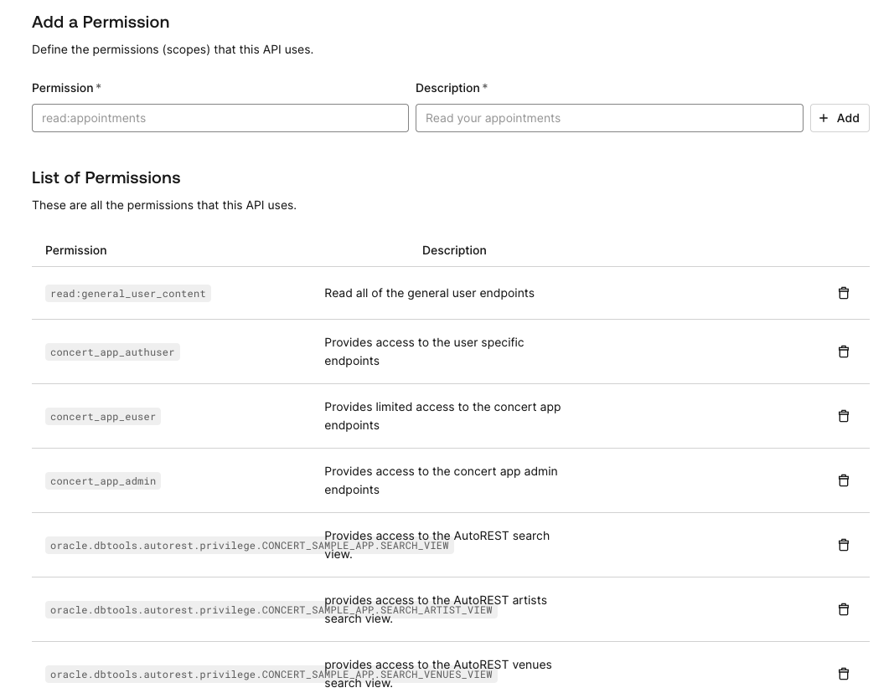
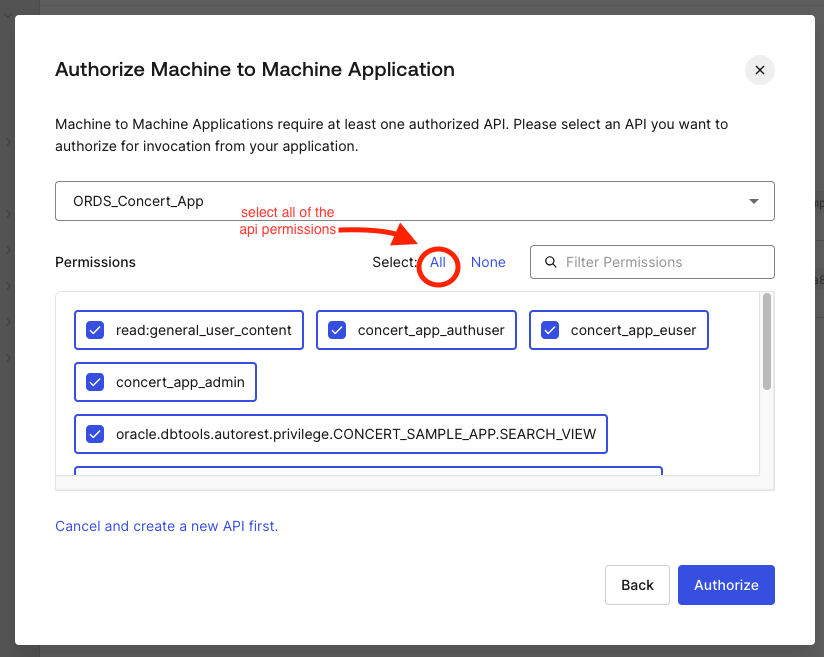
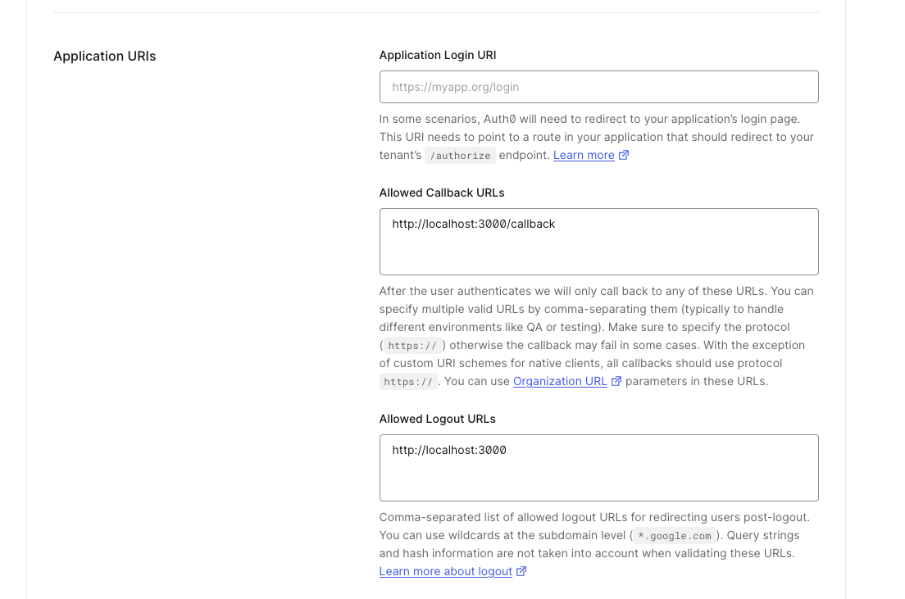
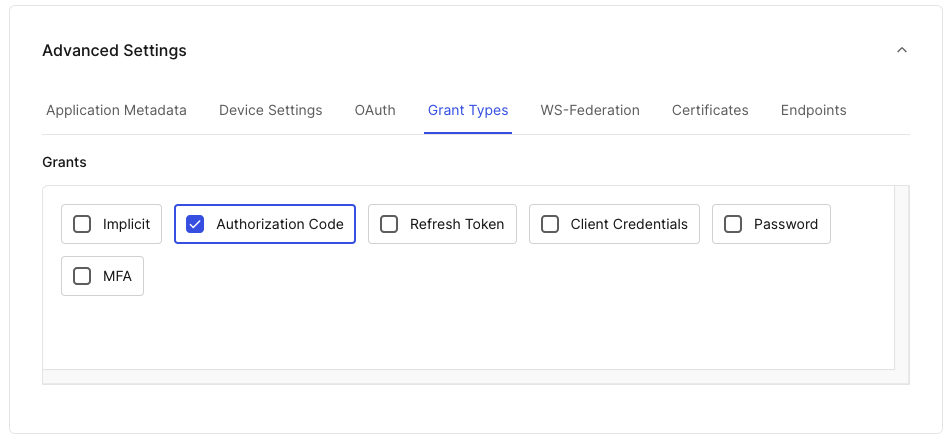
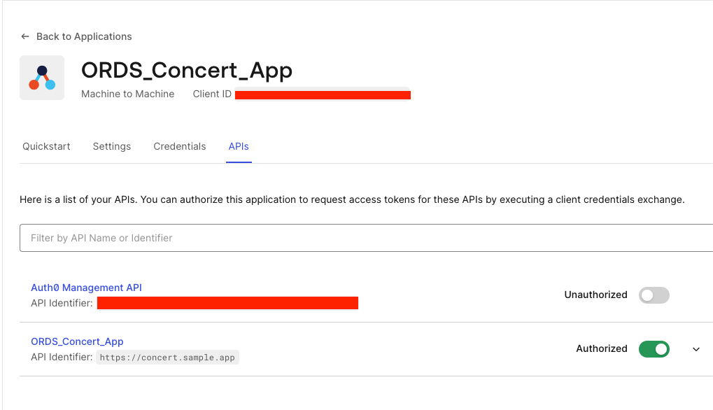

# ORDS Concert App - Securing the Services

When developing REST APIs, it's crucial to protect endpoints and separate use cases to ensure security, data integrity, and proper access control. Mainly because it allows us to:

- Prevent Unauthorized Access: By protecting the ORDS Concert App endpoints, we make sure that only authorized users can access sensitive information and perform specific actions. For example, only admin users should have access to endpoints that modifies or deletes data from our tables.

- Control Data Operations: Ensuring that only certain users can perform specific operations (e.g., data updates or deletions) prevents accidental or intentional data manipulation by unauthorized users.

- Improve User Experience: By segmenting access based on users, we can provide a more tailored and relevant experience to different types of users. Admins get access to management features, while regular users get a simplified interface.

- Error Prevention: Restricting access helps prevent users from encountering functions they shouldn't use, reducing the chance of user errors.

Now consider the ORDS Concert App Use case in which we limit the operations that a user can perform based on the kind of user that is making the request:

- Authenticated End User (authuser): Should be able to view concert details and subscribe to them but should not access admin functions.

- Admin User (adminuser): Should have access to manage concerts, update event details, and handle user issues.

- Non-Authenticated End User (euser): Should have limited access to browse concerts but not perform actions that require authentication.

To protect our ORDS API endpoints we will implement the [JWT Bearer Token Authentication Workflow](https://docs.oracle.com/en/database/oracle/oracle-rest-data-services/24.2/orddg/developing-REST-applications.html#GUID-32E8F21C-A2CA-4DB5-B1BB-9E5119FCB667)

## Protecting our API Endpoints

First, let's see how the ORDS Concert App Modules are Defined:

| MODULE NAME | PATTERN | COMMENTS |
|------------ | ------- | -------- |
|'concert_app.euser.v1' | /euser/v1/* | Provides access to the first version of the End User RESTful API Endpoints |
|'concert_app.authuser.v1' | /authuser/v1/* | Provides access to the first version of the Authenticated User RESTful API Endpoints |
|'concert_app.admin.v1' | /adminuser/v1/* | Provides access to the first version of the Administrator RESTful API Endpoints |

The key part here is the Module Pattern and how it can be used to define an ORDS privilege.

ORDS allows us to define [Privileges](https://docs.oracle.com/en/database/oracle/oracle-rest-data-services/24.2/orddg/oracle-rest-data-services-administration-pl-sql-package-reference.html#GUID-460E2355-A25A-4BE8-BF1F-3221A91147F7). Privileges are used to control access to specific endpoints. A privilege pattern allows us to define which users or roles can access certain URLs, ensuring that only authorized users can perform specific actions on the ORDS Concert App API Endpoints.

Now, we need to define three privileges, one for each kind of user the ORDS Sample App has:

```sql
    DECLARE
        l_roles     OWA.VC_ARR;
        l_modules   OWA.VC_ARR;
        l_patterns  OWA.VC_ARR;
    BEGIN
        l_modules(1) := 'concert_app.authuser.v1';

        ORDS.DEFINE_PRIVILEGE(
            p_privilege_name => 'concert_app_authuser',
            p_roles          => l_roles,
            p_patterns       => l_patterns,
            p_modules        => l_modules,
            p_label          => 'authenticated end user privilege',
            p_description    => 'Provides access to the user specific endpoints',
            p_comments       => NULL);

        l_roles.DELETE;
        l_modules.DELETE;
        l_patterns.DELETE;

        l_modules(1) := 'concert_app.adminuser.v1';

        ORDS.DEFINE_PRIVILEGE(
            p_privilege_name => 'concert_app_admin',
            p_roles          => l_roles,
            p_patterns       => l_patterns,
            p_modules        => l_modules,
            p_label          => 'Admin user privilege',
            p_description    => 'Provides access to the concert app admin endpoints',
            p_comments       => NULL);

        l_roles.DELETE;
        l_modules.DELETE;
        l_patterns.DELETE;

        l_modules(1) := 'concert_app.euser.v1';

        ORDS.DEFINE_PRIVILEGE(
            p_privilege_name => 'concert_app_euser',
            p_roles          => l_roles,
            p_patterns       => l_patterns,
            p_modules        => l_modules,
            p_label          => 'Non authenticated end user privilege',
            p_description    => 'Provides limited access to the concert app endpoints',
            p_comments       => NULL);

        l_roles.DELETE;
        l_modules.DELETE;
        l_patterns.DELETE;
        COMMIT;
    END;
```

Note that by defining a the `/euser/*`, `/adminuser/*` `/authuser/*` we are protecting every single one of the handlers that belong to that Module, even modules that are part of specific versions of out API. This is because those patterns will always match the beginning of the API endpoint which coincides with the Module Section of the API Endpoint.

At this stage, our API Endpoints are secured and this is great, however, now we need a way to grant users access to such resources and for that we will need to define an application capable of issuing JWT Tokens and tell ORDS to consume and validate tokens coming from that application.

For the ORDS Concert App we will be using an Auth0 Machine to Machine Application. You can follow [The- Auth0 Application Configuration Guide](#the-auth0-application-configuration-guide) to fully configure an Authentication Application that the ORDS Concert App will use to authenticate and authorize users.

Once you have the Authentication App configured and the configuration parameters properly stored in environmental variables, we can proceed with the creation of the JWT Client:

```sql
BEGIN
    OAUTH.DELETE_JWT_PROFILE();
    OAUTH.CREATE_JWT_PROFILE(
        p_issuer => <JWT_ISSUER>,
        p_audience => <JWT_AUDIENCE>,
        p_jwk_url => <JWT_VERIFICATION_KEY>
    );
    COMMIT;
END;
```

With this step completed, the Sample App is now capable of:

- Register new users.
- Identifying existing users and their resources (like liked events, artists and venues).
- Allow authenticated users to perform subscriptions.
- Give Administrator users full control over the ORDS Concert App resources.

## The Auth0 Application Configuration Guide

### First Step: Get an Auth0 Tenant.

Follow the [Official Auth0 Documentation](https://auth0.com/docs/get-started/auth0-overview/create-tenants) to set up your own Auth0 tenant.

Once you have your own Auth0 tenant configured and ready to go, you can configure an Auth0 application that the ORDS Sample App will consume.

### Setting up the Auth0 App

The ORDS Concert App uses a Machine-to-Machine workflow to register and authenticate users with the help of JWT tokens and for that we need to configure an Auth0 API and an Auth0 Machine-to-Machine App with an specific set of configurations so the app can work as intended.

### Second Step: Register an Auth0 Authentication API.

First, we need to register an Auth0 Authentication API. Follow the [Register API Auth0 Guide](https://auth0.com/docs/get-started/auth0-overview/set-up-apis) to do it so using the following configuration that the ORDS Concert App expects:


The key part here is the API Identifier, you can use whichever name you want and it should be stored in the `JWT_AUDIENCE` environment variable of your `.env` file.

```bash
JWT_AUDIENCE=https://concert.sample.app
```

This is the audience that both the ORDS Sample App and the ORDS JWT Client will use to request and validate JSON Web Tokens.

### Third Step: Grant permissions to the recently created API.

Now that we have created our API, go to the `Permissions` tab and grant it the following permissions/privileges.

> [!IMPORTANT]
> Replace <SCHEMA_NAME> with the `SCHEMA_NAME` variable specified on your `.env` file. 

| Permission | Description | What it does in the ORDS Sample App |
| ---------- | ----------- | ----------- |
|read:general_user_content | Read all of the general user endpoints |  Allows the Sample App to read user information like first name, last name, email and Auth0 ID |
| concert_app_authuser | Provides access to the user specific endpoints |  Allows authenticated users to interact with user specific ORDS Endpoints, like subscribing to a concert and more. |
| concert_app_euser | Provides limited access to the concert app endpoints | Allows unauthenticated users to interact with limited ORDS Endpoints. |
| concert_app_admin | Provides access to the concert app admin endpoints | Allows authenticated admin users to interact with user specific ORDS Endpoints, like the create or delete Artist Endpoints. |
| oracle.dbtools.autorest.privilege.`<SCHEMA_NAME>`.SEARCH_VIEW | Provides access to the AutoREST search view. | Allows every user of the ORDS Concert App to access the search/discover functionality. |
oracle.dbtools.autorest.privilege.`<SCHEMA_NAME>`.SEARCH_ARTIST_VIEW | Provides access to the AutoREST artists search view. | Allows every user of the ORDS Concert App to access the search/discover functionality. |
| oracle.dbtools.autorest.privilege.`<SCHEMA_NAME>`.SEARCH_VENUES_VIEW | Provides access to the AutoREST venues search view. | Allows every user of the ORDS Concert App to access the search/discover functionality. |

Once you have added all of the permissions described above your list of permissions should look like this. 



Once you have the app configured, we can go to the next step: configure a Machine-to-Machine Auth0 Application.

### Fourth Step: Configure a Machine-to-Machine Application.

To do it so, follow the [Register Machine-to-Machine Applications Auth0 Guide](https://auth0.com/docs/get-started/auth0-overview/create-applications/machine-to-machine-apps) up until the point where you need to select the API that will be using from this app and use Auth0 API that you created and configured in the [Second Step](#second-step-register-an-auth0-authentication-api):



Once you have selected the Auth0 API, grant it all of the `ORDS_Concert_App` permissions to the application to ensure that an authenticated user will have full access to the application functionalities.

To finish this step, click on the `Authorize` to create your Machine-to-Machine app and go to the next step. 

### Fifth Step: Add Auth0 configuration settings to your `.env` file. 

With the Machine to Machine App created, go to the `Settings` tab and store the following information in the corresponding environmental variables of your `.env` file:

```bash
AUTH0_DOMAIN=my-domain.auth0.com
AUTH0_LOGOUT_URL=https://my-domain.auth0.com/v2/logout
JWT_ISSUER=https://my-domain.auth0.com/
AUTH0_CLIENT_ID=<YOUR_CLIENT_ID>
AUTH0_CLIENT_SECRET=<YOUR_CLIENT_SECRET>
```


In that same `settings` page scroll down to `Application URIs` and configure `Allowed Callback URLs` and `Allowed Logout URLs` as follows:

```bash
Allowed Logout URLs = http://localhost:3000
Allowed Callback URLs = http://localhost:3000/callback
```



Store those same variables in the `AUTH0_RETURN_TO_URL` and `AUTH0_CALLBACK_URL` environment variables of your `.env` file:

```bash
AUTH0_RETURN_TO_URL=http://localhost:3000
AUTH0_CALLBACK_URL=http://localhost:3000/callback
```

Note: The URL and port specified in these fields must match with ones used by the ORDS Concert App, by default Remix will try to use the `3000` port to serve the app but if that port is being used by other app another port will be chose at random,  you may need to add more URLS to those fields. 

For the rest of this section you can leave everything as it is or configure it as you see fit.

### Sixth Step: Configure the application grant type. 

Now, go down to the `Advanced Settings` section and under grant types choose `Authorization Code` as it shows in the image above:



### Seventh Step: Configure the `JWT_VERIFICATION_KEY` variable.

Stay in `Advanced Settings` and choose the `Endpoints` option and store the `JSON Web Key Set` value in the `JWT_VERIFICATION_KEY` environmental variable in your `.env` file:


```bash
JWT_VERIFICATION_KEY=<JSON_WEB_KEY_SET>
```

Don't forget to save your changes before going to the last step.

### Eighth Step: Making sure the app can request access tokens

Finally, go to the API section and make sure that the Machine to Machine Application is authorized to request access tokens for these APIs by executing a client credentials exchange.



At this stage your `.env` file should look something like this:

```bash
AUTH0_CLIENT_ID=auth0_client_id
AUTH0_CLIENT_SECRET=auth0_client_secret
JWT_ISSUER=https://dev-yourDomain1234.us.auth0.com
JWT_VERIFICATION_KEY=https://my-domain.auth0.com/oauth/token/.well-known/jwks.json
JWT_AUDIENCE=https://concert.sample.app
AUTH0_RETURN_TO_URL=http://localhost:3000
AUTH0_CALLBACK_URL=http://localhost:3000/callback
AUTH0_DOMAIN=my-domain.auth0.com
AUTH0_LOGOUT_URL=https://my-domain.auth0.com/v2/logout
```